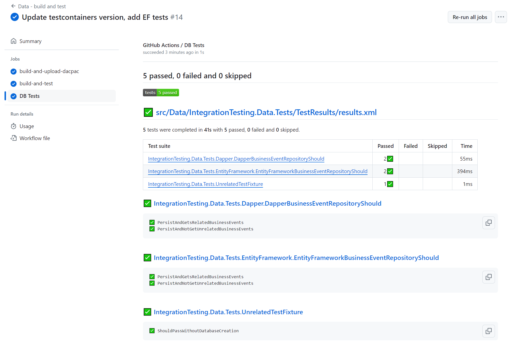

# Integration testing with testcontainers

*Inspired by: https://www.youtube.com/watch?v=8IRNC7qZBmk&t=339s*

## The problem
Without provisioning dedicated infrastructure, integration testing can be hard to get right in a CICD pipeline. For example - if I am testing that my app still works with a new SQL Server table schema, I might have to:

Provision ephemeral infrastructure before test run
- Provisioning new infrastructure can take a long time,
- Additional complexity in the CICD pipeline,
- If this is done in the cloud, it could cost a fair bit of $$$!

Run tests against a long-lasting test server
- Risk that test data conflicts between testRunX and testRunY, giving false positives/negatives,
- Inability to test more than one version of the database at any one time,
- Risk that the server corrupts itself/becomes unavailable, blocking all testing,
- Even when tests aren't being run, I'm still paying for the instance.

## Testcontainers
In summary, this library lets you quickly spin up throwaway infrastructure such as SQL Server/Redis/etc and target your tests against the running container. This allows you to quickly validate that, for example, your repository implementation still works with your new SQL Server table schema. I have a sample project using testcontainers you can read through here: https://benchiverton.github.io/Blog/project/TestContainers. The interesting classes in the solution are:

[DatabaseContainer](https://github.com/benchiverton/DotNet.IntegrationTesting/blob/main/src/Data/IntegrationTesting.Data.Tests/TestInfrastructure/DatabaseContainer.cs), this is what manages the Docker containers running SQL Server.

[BusinessEventRepositoryShould](https://github.com/benchiverton/DotNet.IntegrationTesting/blob/main/src/Data/IntegrationTesting.Data.Tests/Repositories/BusinessEventRepositoryShould.cs), these are the tests using `DatabaseContainer` that verify the repository code is compatible with the SQL Server schema.

### Testcontainers pre-requisites
All that is needed is access to a Docker-API compatible container runtime. As I use Windows, one option is to install Docker Desktop, but I find it hard to justify the cost as I am just using the Docker-API. I opted to install docker on Windows Subsystem for Linux (WSL), and configure the daemon to expose itself via a TCP socket. For details on how to do this, please see [this guide](https://benchiverton.github.io/Blog/blogpage/InstallingDocker).

## CICD with GitHub Actions
Right now, Microsoft's support for sqlproj's is poor. They haven't been migrated sqlproj's to .NET Core, and the documentation for SQL Server Data Tools (SSDT) isn't as thorough as a lot of their other documentation. As a result, I've created some custom images that has the required toold to build a sqlproj installed. The CI pipeline I've created has the following workflows:

### Build and publish dacpac's
[[dockerfile](../docker/sqltools/dockerfile)] for image with SSDT and DAC

[[workflow](../.github/workflows/docker_build-and-publish-sqltools.yaml)] to build and publish image with SSDT and DAC

[[job](https://github.com/benchiverton/DotNet.IntegrationTesting/blob/d593d53a49c76599c1e90a0837aa12bb45af3697/.github/workflows/ci_build-and-test-data.yml#L13)] to build and publish dacpac

### Build and test .NET application
[[job](https://github.com/benchiverton/DotNet.IntegrationTesting/blob/d593d53a49c76599c1e90a0837aa12bb45af3697/.github/workflows/ci_build-and-test-data.yml#L33)] to build and test dotnet application

Example test report: 

## Should all integration tests be written using test containers?

I don't think so. This approach allows you to test how two different modules of code that interface with each other, but fails to account for any issues with the hosting platform - not all infrastructure will be deployed to a container in production. For example, the app might function correctly in a SQL Server container, but if it's deployed to Azure SQL there is no promise that the same features are available.

## Summary

I think testcontainers are a great addition to anybody's test suite. They allow you to quickly validate how two different pieces of technology will interface with eachother without having to deploy the whole system. However, I think you need to be wary that these tests were not conducted on a platform similar to production, and that in some cases behaviour may change between a test container and the real deal.
